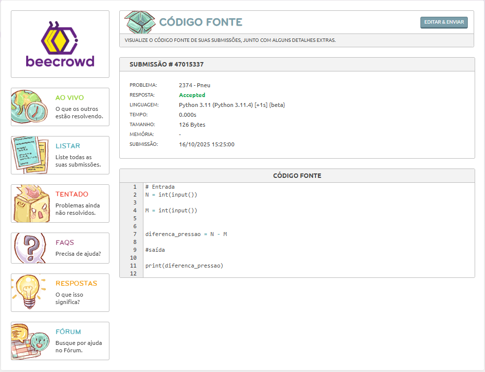

# Dia 02 - Treino de Lógica em Python

**Data:** 16/10/2025  
**Tema do dia:** Lógica em python - desafios simples  
**Tempo de estudo:** 1h10
**Plataforma:** Beecrowd

---

## Desafio resolvido

| Desafio | Nome do Desafio   | Status    | Nível         | Observações                                                                            |
| ------- | ----------------- | --------- | ------------- | -------------------------------------------------------------------------------------- |
| 2413    | Busca na Internet | Concluído | Fácil         | Aprendi a visualizar mais o problema e solucionar ele, antes de sair codando           |
| 2374    | Pneu              | Concluído | Fácil         | Aprendi a visualizar mais o problema e solucionar ele, antes de sair codando           |
| 1023    | Estiagem          | Andamento | Intermediário | Estou tendo dificuldades e tendo que dividir o problema em partes, mas irei conseguir! |

---

## Resultados

### Desafio 2413 – Busca na Internet e Desafio 2374 - Pneu

### Nível: Iniciante

---

## Aprendizado do dia

- O treino diário estimula o crescimento e o foco para aprender.
- Me ambientalizei com a plataforma
- Estou dividindo e progredindo aos poucos, com algumas pesquisas para concluir o desafio 1023 - Estiagem

## Dificuldades

- Minha dificuldade está em colocar na prática a solução do desafio 1023.

---

## Próxima meta

- Concluir o desafio Estiagem e reforçar as estruturas usadas neste desafio.
- Resolver pelo menos 2 desafios de repetição e condição amanhã.
