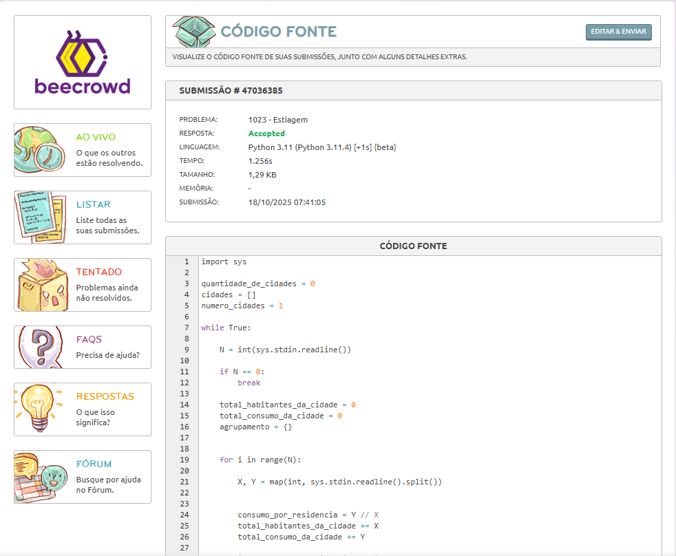

# Dia 02 - Treino de Lógica em Python

**Data:** 18/10/2025

**Tema do dia:** Bibliotecas, Estruturas e listas em Python

**Tempo de estudo:** 1h40

**Plataforma:** Beecrowd

---

## Desafios

| Desafio | Nome do Desafio   | Status    | Nível         | Observações                                                                                                                                                                                                                                                                                                                  |
| ------- | ----------------- | --------- | ------------- | ---------------------------------------------------------------------------------------------------------------------------------------------------------------------------------------------------------------------------------------------------------------------------------------------------------------------------- |
| 1023    | Estiagem          | Concluído | Intermediário | Ontem identifiquei que pelo tempo de processamento elevado, teria que encontrar bibliotecas python para agilizar o processo, então abri a documentação python e fui atrás e lá estava o sys.stdin.readline(). Procurei a função de truncar, mas há várias formas de truncar e então optei por não tentar usa-la e deu certo! |
| 3048    | Sequência Secreta | Concluído | Fácil         | Pude práticar e experimentar melhor o uso de listas com este desafio, irei pesquisar mais sobre manipulação de listas, dicionários, conjuntos e tuplas.                                                                                                                                                                      |
| 1022    | TDA Racional      | Andamento | intermediário | Entendi a proposta e estou tentando achar uma solução para por os / entre os valores, sem por entre o operador da conta...                                                                                                                                                                                                   |

---

## Resultados

### Desafio 1023 – Estiagem

### Nível: Intermediário

### Desafio 3048 – Sequência Secreta

### Nível: Fácil

### Desafio 1022 – TDA Racional

### Nível: Intermediário

---

## Aprendizado do dia

- Aprendi que bibliotecas python auxiliam e muito no desenvolver do código, tornando eles mais rápidos e funcionais.

- Truncar existe de várias maneiras e formas, até mesmo com strings...

- Pude por em prática a manipulação básica de listas. Com o uso de listas nestes desafios, percebi o quão importante são estes recursos.

- preciso conhecer melhor o split() ou ter que usar outro.

## Dificuldades

- O desafio em si foi desafiador para mim, mesmo depois de conseguir chegar na lógica, ela excedia o tempo de execução, acessei a documentação python ([docs.python.org/sys...](https://docs.python.org/pt-br/3.13/library/sys.html#sys.stdin)) e lá encontrei uma forma de substituir o input, na qual, permitiu o tempo de execução ser adequado.

- Tive dificuldades em encontrar uma função para truncar com duas casas decimais e sem deixar o valor arredondar, a função que encontrei, se parecia mais dificil que a própria execução no código, porém acredito, que em tempo de execução poderia ter sido mais rápido...

- Lembrar de algumas sintaxes que fazia tempo que não as usava.

- separar os valores de entrada por / sem por entre o operador no meio.

## Próxima meta

- Pesquisar mais sobre bibliotecas que me ajudem a diminuir o tempo de execução dos desafios.

- Pesquisar sobre funções de listas, conjuntos, dicionários e tuplas.

- Resolver o desafio intermediário 1022.

- Resolver pelo menos 2 desafios amanhã.
