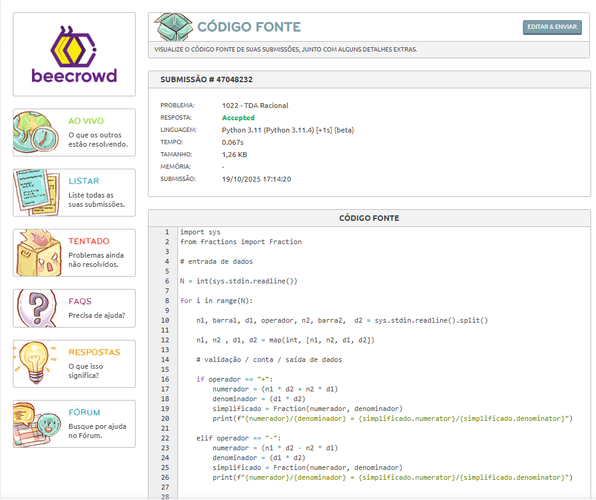

# Dia 02 - Treino de Lógica em Python.

**Data:** 19/10/2025

**Tema do dia:** Bibliotecas(fractions) e Estruturas em Python

**Tempo de estudo:** 1h30

**Plataforma:** Beecrowd e documentação Python

---

## Desafios

| Desafio | Nome do Desafio | Status    | Nível         | Observações                                                                                                                                                                                                              |
| ------- | --------------- | --------- | ------------- | ------------------------------------------------------------------------------------------------------------------------------------------------------------------------------------------------------------------------ |
| 1022    | TDA Racional    | Concluído | intermediário | tive que pesquisar por bibliotecas que me ajudassem a simplificar a fração, pois estava a pensar no tempo limit e ao procurar, logo encontei o Fraction a função da biblioteca fractions que facilita e muito o desafio. |

---

## Resultados

### Desafio 1022 – TDA Racional

### Nível: Intermediário

---

## Aprendizado do dia

- Aprendi que bibliotecas python auxiliam e muito no desenvolver do código, tornando eles mais rápidos e funcionais - salvadoras kk.

- Desafios/testes estão sendo muito importantes para meu desenvolvimento.

- No inicio parece ser impossível, mas ao colocar a mão na massa, tudo se torna mais fácil.

## Dificuldades

- O desafio no inicio pareceu mais complicado do que realmente foi, tive que ir atrás de uma biblioteca para simplificar a fração, pensei logo em uma biblioteca, pelo tempo limite do desafio que poderia exceder.

- A entrada de dados foi um leve problema no inicio, pois não sabia como ignorar as barras, mas sem ignorar a barra que representa a divisão.

## Próxima meta

- Pesquisar mais sobre bibliotecas que me ajudem a diminuir o tempo de execução dos desafios.

- Pesquisar mais sobre entrada de dados e métodos dos mesmos.

- Resolver pelo menos 1 desafios amanhã.

- Desenvolver meu projeto SeenBook amanhã.
