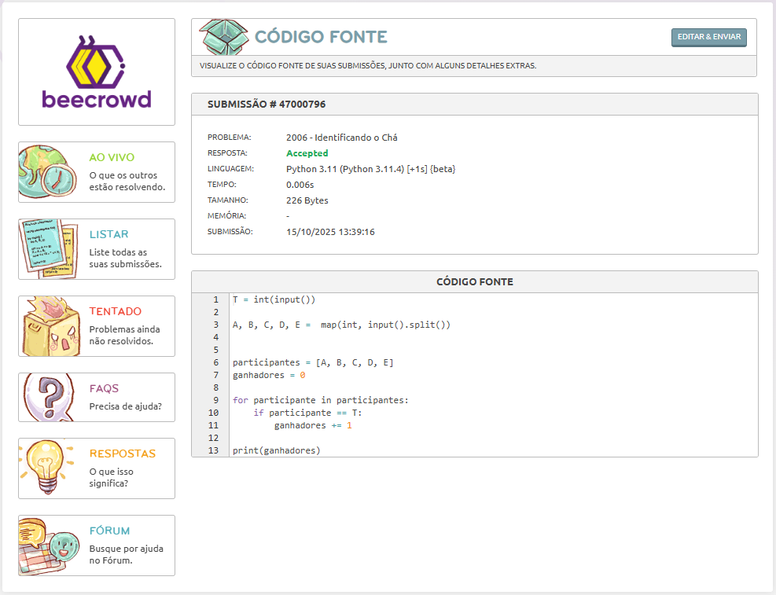

# Dia 01 - Treino de Lógica em Python

**Data:** 15/10/2025  
**Tema do dia:** Estrutura de repetição e controle simples - desafio simples  
**Tempo de estudo:** 1h00  
**Plataforma:** Beecrowd

---

## Desafio resolvido

| Desafio | Nome do Desafio     | Status       | Observações                                                                               |
| ------- | ------------------- | ------------ | ----------------------------------------------------------------------------------------- |
| 2006    | Identificando o Chá | Concluído ✅ | Aprendi estrutura de repetição e controle na prática, além do funcionamento dos desafios. |

---

## Resultados

### Desafio 2006 – Identificando o chá

### Nível: Iniciante

---

## Aprendizado do dia

- Entendi que a prática diária ajuda a fixar lógica das estruturas de repetição e controle, além do funcionamento do código em si.
- Percebi que planejar e pensar no problema antes de codificar, ajuda a entender e solucionar o problema.
- Comecei a me familiarizar com o formato de desafios Beecrowd.

## Dificuldades

- Minha principal dificuldade foi me adaptar e entender a plataforma Beecrowd. Com o curso da Santander Bootcamp de 2025, tive vários desafios e atividades, nas quais, foram feitas na plataforma da Dio, na Dio o código é visualizado diferente, ele lê mensagens de input/print e testa a validação das entradas, então nesse desafio, eu entendi que ele poderia me testar, colocando um caractere especial ou letra na entrada de int, ocorrendo um erro, com esse pensamento fiz a validação utilizando whiles, try e except para validar e aceitar somente números corretamente... Pesquisando aprendi que a plataforma não joga valores diferentes dos quais mostra na entrada e saída dos testes, assim, compreendendo o funcionamento da Beecrowd.
- Tive dificuldades em lembrar de algumas sintaxes para o uso, mas com pesquisas em foruns me auxiliaram rapidamente.

---

## Próxima meta

- Treinar estruturas de repetição e controle em testes e desafios
- Resolver pelo menos 1 desafios de repetição e condição amanhã.
