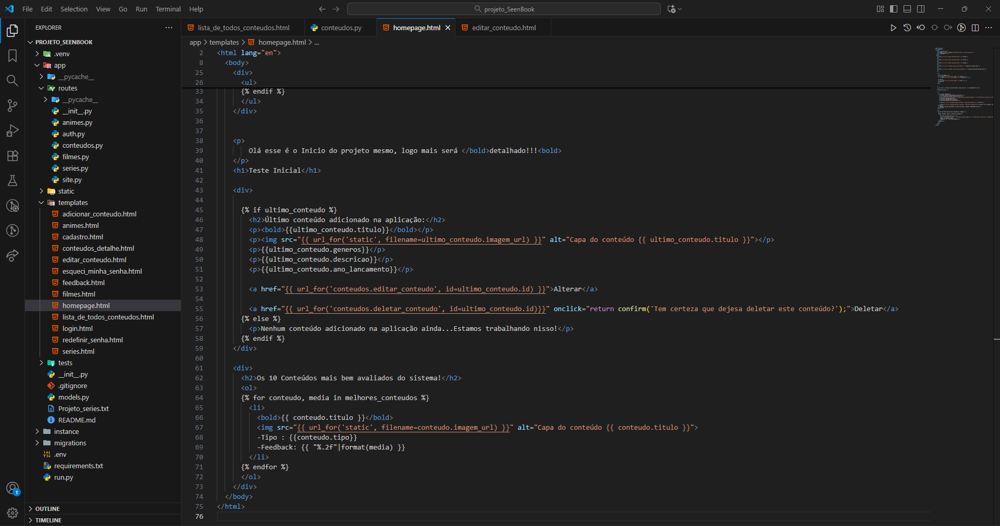

# Dia 06 - Desenvolvimento do projeto SeenBook.

**Data:** 20/10/2025

**Tema do dia:** Bibliotecas(fractions), flask, html e Estruturas em Python

**Tempo de estudo:** 1h20

**Plataforma:** VSCode e web

---

## Projetos

| Desafio | Nome do Desafio  | Status    | Nível         | Observações                                                                                                                                                             |
| ------- | ---------------- | --------- | ------------- | ----------------------------------------------------------------------------------------------------------------------------------------------------------------------- |
| -       | Projeto SeenBook | Andamento | intermediário | hoje atualizei as capas dos conteúdos, troquei de url da web que podem quebrar, para as imagens dentro do static. Também implementei gêneros na exibição dos conteúdos. |

---

## Resultados

### Projeto – SeenBook

### Nível: Intermediário

---

## Aprendizado do dia

- Aprendi a usar melhor o url_for().

- Aprendi mais sobre o funcionamento do Flask/Jinja2.

- Pude compreender e práticas a manipulação de dados entre html e python.

## Dificuldades

- conectar a URL_FOR() na pasta static/capas e pegar as imagens relacionadas ao conteúdo dela.

## Próxima meta

- Resolver pelo menos 1 desafios amanhã.

- Desenvolver meu projeto SeenBook e corrigir bugs.
