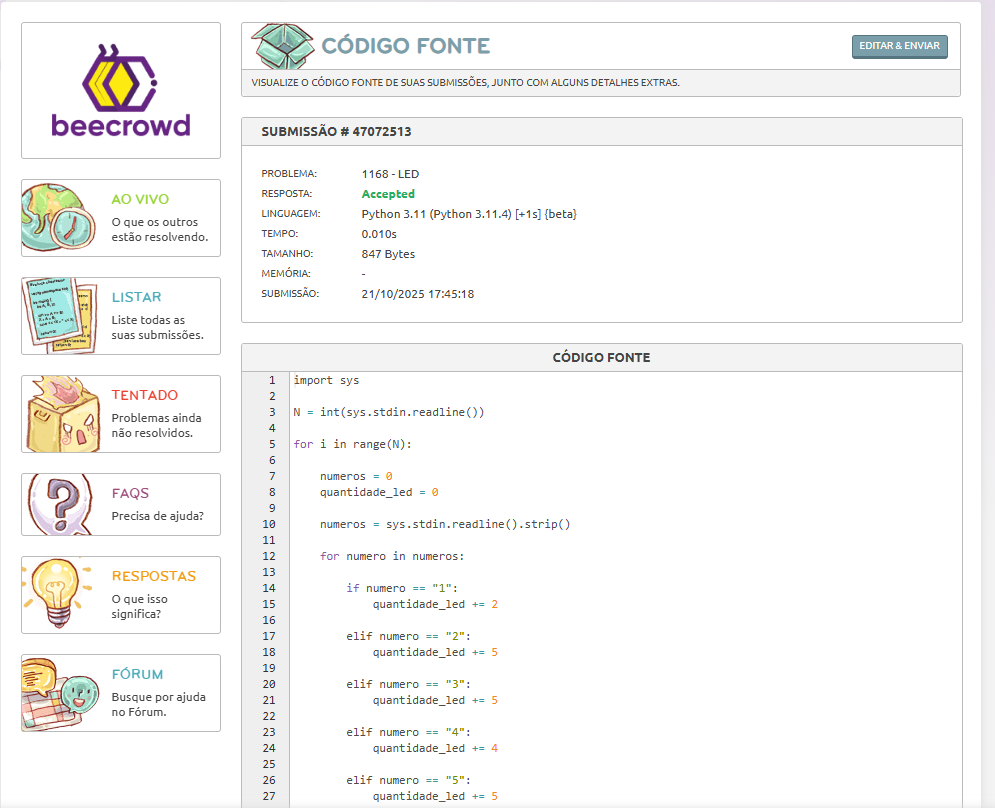

# Dia 07 - Treino de Lógica em Python e Aula de IHC.

**Data:** 21/10/2025

**Tema do dia:** Interação Humano-Computador e Lógica em Python

**Tempo de estudo:** 2h30

**Plataforma:** Beecrowd e Matéria Uniasselvi

---

## Desafios

| Desafio | Nome do Desafio         | Status    | Nível         | Observações                                                                             |
| ------- | ----------------------- | --------- | ------------- | --------------------------------------------------------------------------------------- |
| 1168    | LED                     | Concluído | Fácil         | Não tinha entendido o que o desafio pedia, mas após entender o desafio em si, foi fácil |
| 1068    | Balanço de Parênteses I | Andamento | Intermediário | Estou tendo dificuldade na saída, sem validar como correct                              |

---

## Resultados

### Desafio 1168 – LED

### Nível: Fácil

---

## Aprendizado do dia

- Hoje em aula pude aprender sobre a técnica de McCabe, ela mostra a complexidade do código, diante as tomadas de decisões dentro dele, espelhando na dificuldade de manter.

- Aprendi também sobre SQM e ISO/IEC 25000 e sua família (substituta da ISO 9126), ela define 8 características principais que um software de qualidade deve ter: Funcionalidade, Confiabilidade, Usabilidade, Eficiência de desempenho, Manutenibilidade, Portabilidade, Compatibilidade e Segurança.

- A IA se usada de forma inteligente é uma grande aliada para o aprendizado, além de te desafiar, ela instiga a lógica e auxilia na conclusão, sem te dar respostas ou copia e cola. Só depende do modo de usa-la

- funcionamento melhor das entrada de dados, como split()

- Aprendi mais sobre IHC e seu objetivo de tornar a interação eficiente, segura e agradável.

## Dificuldades

- A saída de dados do desafio 1068 sem validar como correct, mesmo com o strip(), ele continua dando valor ao enviar os dados vazios...

- Entender o que o desafio LED em si pedia, mas consegui prosseguir

## Próxima meta

- Encontrar a(as) solução(ões) do desafio Balanço de parênteses I

- Foco em desenvolver meu projeto SeenBook(SB).

- Corrigir delete das series e filmes no SB.

- Corrigir mensagens no Feedback e outros ajustes.

- Pesquisar e entender melhor a semântica das tags html e implementa-la no projeto.

- Pesquisar e entender melhor a ISO/IEC 25000 e sua família.
