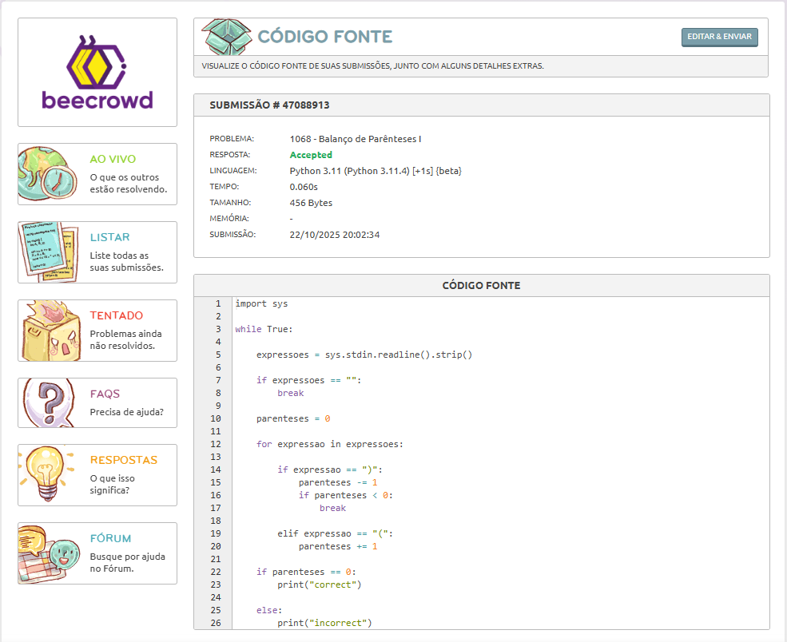

# Dia 08 - Treino de Lógica em Python e Desenvolvimento do Projeto SeenBook.

**Data:** 22/10/2025

**Tema do dia:** Projeto SeenBook e Lógica em Python

**Tempo de estudo:** 1h10

**Plataforma:** Beecrowd e SeenBook

---

## Desafios

| Desafio | Nome do Desafio         | Status    | Nível         | Observações                                                                                                                                                                                  |
| ------- | ----------------------- | --------- | ------------- | -------------------------------------------------------------------------------------------------------------------------------------------------------------------------------------------- |
| -       | SeenBook                | Andamento | Intermediário | Estou corrigindo erros e identificando bugs, após corrigir, irei para a semântica html                                                                                                       |
| 1068    | Balanço de Parênteses I | Concluído | Intermediário | No fim minha lógica estava certa, apenas não tinha deixado um espaço na validação do valor nulo, fui atrás e vi flag e métodos de deixar mais funcional e acabou excedendo o limite de tempo |

---

## Resultados

### Desafio 1068 – Balanço de Parênteses I

### Nível: Intermediário

---

## Aprendizado do dia

- Hoje corrigi a consulta do banco de dados que em ordem alfabética que diferenciava maiúsculo de minúsculo e algumas alterações no html do projeto.

- As vezes quanto mais métodos e novas estruturas implementamos, só complicamos o código. Então antes de codar, é sempre bom pensar...

## Dificuldades

- Identificar o porque o desafio 1068 não aceitava, mesmo com o strip() o valor "" era dado como correct, isso bagunçou a lógica kk.

## Próxima meta

- Foco em desenvolver meu projeto SeenBook(SB).

- Corrigir delete das series e filmes no SB.

- Corrigir mensagens no Feedback.

- Pesquisar e entender melhor a semântica das tags html e implementa-la no projeto.
