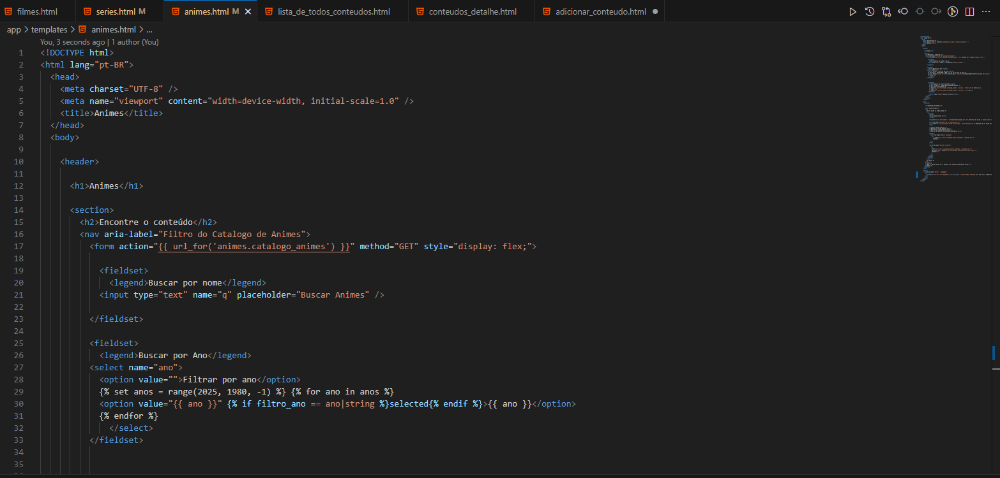

# Dia 09 - Retorno, Pesquisa, conclusão de Provas da Graduação Interação Humano-Computador e o Desenvolvimento do Projeto SeenBook.

**Data:** 23/10/2025 até o 03/11/2025

**Tema do dia:** Retorno, Matéria Interação Humano-Computador e Projeto SeenBook.

**Tempo de estudo:** 2h30

**Plataforma:** AVA Uniasselvi, Google e SeenBook.

---

## Nota de aviso

Fiquei alguns dias afastado dos estudos por causa de uma gripe forte que me derrubou um pouco e também pela carga de trabalho, que aumentou bastante. Resolvi dar esse tempo para recuperar bem o corpo e a mente, além de me acostumar ao novo ritmo — afinal, estudar também exige estar bem fisicamente e cumprir com as responsabilidades do dia a dia.

Durante a semana, continuei estudando, mas sem atualizar os arquivos markdown.  
Hoje, volto com tudo, retomando o foco e a constância no aprendizado.  
A ideia continua a mesma: evoluir um pouco a cada dia, registrando cada avanço e desafio enfrentado no caminho.

Mesmo com as pausas, o importante é manter o compromisso de seguir em frente — ajustando o ritmo quando necessário, mas nunca parando de aprender.

---

## Desafios

| Desafio | Nome do Desafio | Status    | Nível         | Observações                                                |
| ------- | --------------- | --------- | ------------- | ---------------------------------------------------------- |
| -       | SeenBook        | Andamento | Intermediário | Implementando a semântica html nas páginas html do projeto |

---

## Resultados

### Projeto SeenBook – Semântica html

### Nível: Intermediário

### Provas e Conteúdos da Graduação

Essa semana resolvi 2 avaliações e dei uma boa revisão no conteúdo, onde pude aprender mais sobre Interação Humano-Computador...

---

## Aprendizado do dia

- Hoje aprendi sobre as oito principais características da ISO/IEC 25010:2011(SQuaRE - System and Software Quality Requirements and Evaluation) são elas: Adequação Funcional, Eficiência de Desempenho, Compatibilidade, Usabilidade, Confiabilidade, Segurança, Manutenibilidade e Portabilidade. Pude dar uma revisada nas principais características e subcaracterísticas, saciando por enquanto a curiosidade que tinha sobre essa família de normas.

- Aprendi sobre as 10 Heurísticas de Usabilidade de Jacob Nielsen: Visibilidade do Status do Sistema (Visibility of System Status); Correspondência entre o Sistema e o Mundo Real (Match Between System and the Real World); Liberdade e Controle do Usuário (User Control and Freedom); Consistência e Padrões (Consistency and Standards); Prevenção de Erros (Error Prevention); Reconhecimento em Vez de Recordação (Recognition Rather than Recall); Flexibilidade e Eficiência de Uso (Flexibility and Efficiency of Use); Estética e Design Minimalista (Aesthetic and Minimalist Design); Ajude os Usuários a Reconhecer, Diagnosticar e Recuperar-se de Erros (Help Users Recognize, Diagnose, and Recover from Errors) & Ajuda e Documentação (Help and Documentation).

  Pude compreender que essas heurísticas são extremamente importantes, pois nos dizem pontos importantes a serem seguidos, tornando o sistema mais aceito pelos usuários e fáceis de operar. O segundo(Match Between System and the Real World), me chamou mais atenção pelo fato que o usuário deve se sentir familiarizado com os elementos representativos, mas isso de modo geral, ou seja, símbolos usados frequentemente, ou associados universalmente e não apenas aqueles que um público específico entenderia. Outro que me despertou curiosidade foi o (Help Users Recognize, Diagnose, and Recover from Errors), pois ele explica sobre a importância de manter o usuário ciente do erro que foi cometido e o auxiliar para consertar o erro, este me chamou a atenção, pois recentemente estive passando por essa parte no meu projeto (implementando novas funções e cadastros), onde tive um pouco de dificuldade de informar sobre o erro ao usuário, me lembrando de pôr no Trello para dar uma revisada no código futuramente.

- Pude Aprender também sobre a importância de analisar antes de subir um commit ou um conjunto deles, pois em meu projeto, acabei subindo com o .gitignore em uma pasta abaixo do .env, mostrando a minha senha do flask e aplicativo de envio e-mails no repositório, foi um aprendizado para sempre prestar o dobro de atenção na hora de subir um push.

## Dificuldades

- Entender inicialmente a funcionalidade dos fieldset, porém entendi e pude práticar.

- Recordar de algumas sintaxes html

## Próxima meta

- Foco em desenvolver meu projeto SeenBook(SB).

- Adicionar uma nova feature de detalhes no ultimo conteúdo e os 10 mais vistos do SB.

- Corrigir mensagens no Feedback.
